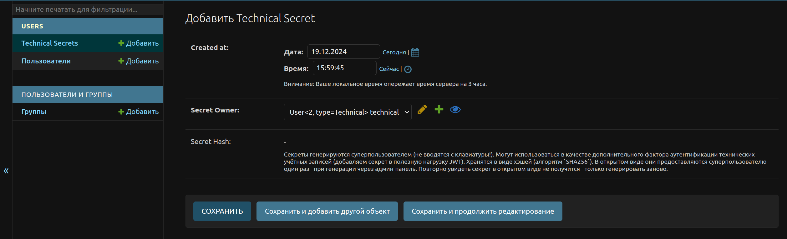
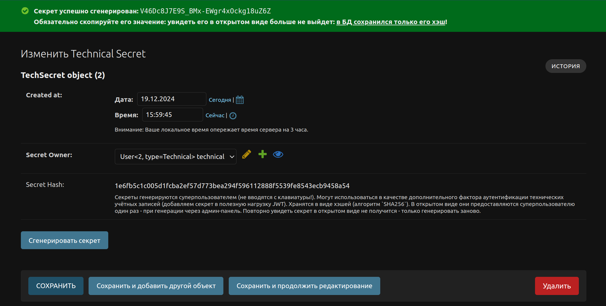
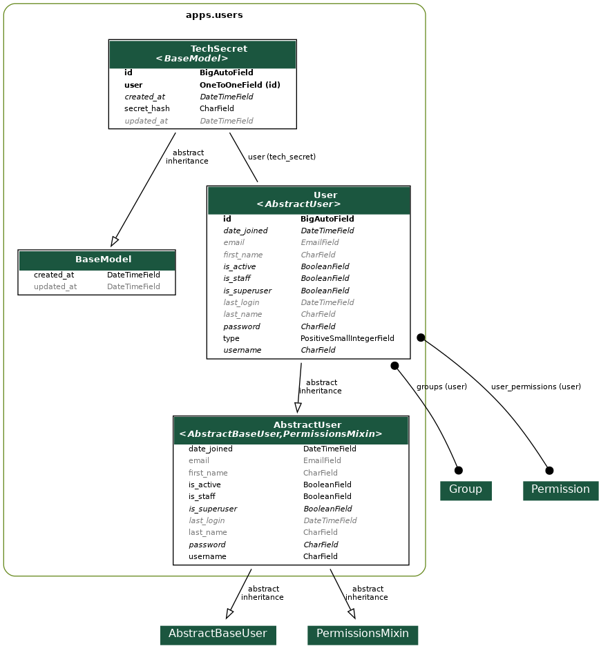

# Простое управление секретами технических УЗ

PoC простого подхода управления секретами технических учётных записей. Они могут в частности использоваться для
интеграции внешних систем.

- Секреты генерируются суперпользователем из админ-панели (не вводятся с клавиатуры!).
- Могут использоваться в качестве дополнительного фактора аутентификации технических учётных записей
  (добавляем секрет в полезную нагрузку `JWT`). Хранятся в виде хэшей (алгоритм `SHA256`).
- В открытом виде они предоставляются суперпользователю один раз - при генерации через админ-панель.
  Повторно увидеть секрет в открытом виде не получится - только генерировать заново.
- Если секрет утёк или был утерян, просто перегенерируем его в админке по кнопке,
  передаём системе-интегратору по защищённому каналу связи.

## Создание сущности технического секрета

В примере приложения у модели `User` есть поле `type`, определяющее тип учётной записи.
Для типа учётной записи `User.Type.TECHNICAL`, администратор системы может создать экземпляр сущности `TechSecret`.

`secret_hash` является read-only полем - его нельзя ввести с клавиатуры, оно генерируется
автоматически и псевдослучайно (исходный код в [apps/users/services/secret.py](apps/users/services/secret.py)).

Администратор системы видит готовый секрет в информационном сообщении об успещной генерации секрета.
В БД сохраняется хэш этого секрета (по умолчанию `SHA256`). То есть компрометация таблицы технических секретов БД не
позволит злоумышленнику получить секрет в открытом виде.

Если секрет утёк или был утерян, администратор системы перегенерирует его в админ-панели при помощи пользовательской
кнопки **"Сгененрировать секрет"**.

## Диаграмма классов приложения `apps.users`

Связь между `TechSecret` и `User` - **OneToOne**, дабы не хранить кучу `null`-записей для пользователей, для которых
эти секреты не нужны. Это действительно верное решение, поскольку на 1'000'000 пользователей у нас может быть,
к примеру, всего порядка десятка технических УЗ.

`python manage.py graph_models users -g -o assets/images/users_app_modelviz.png`

